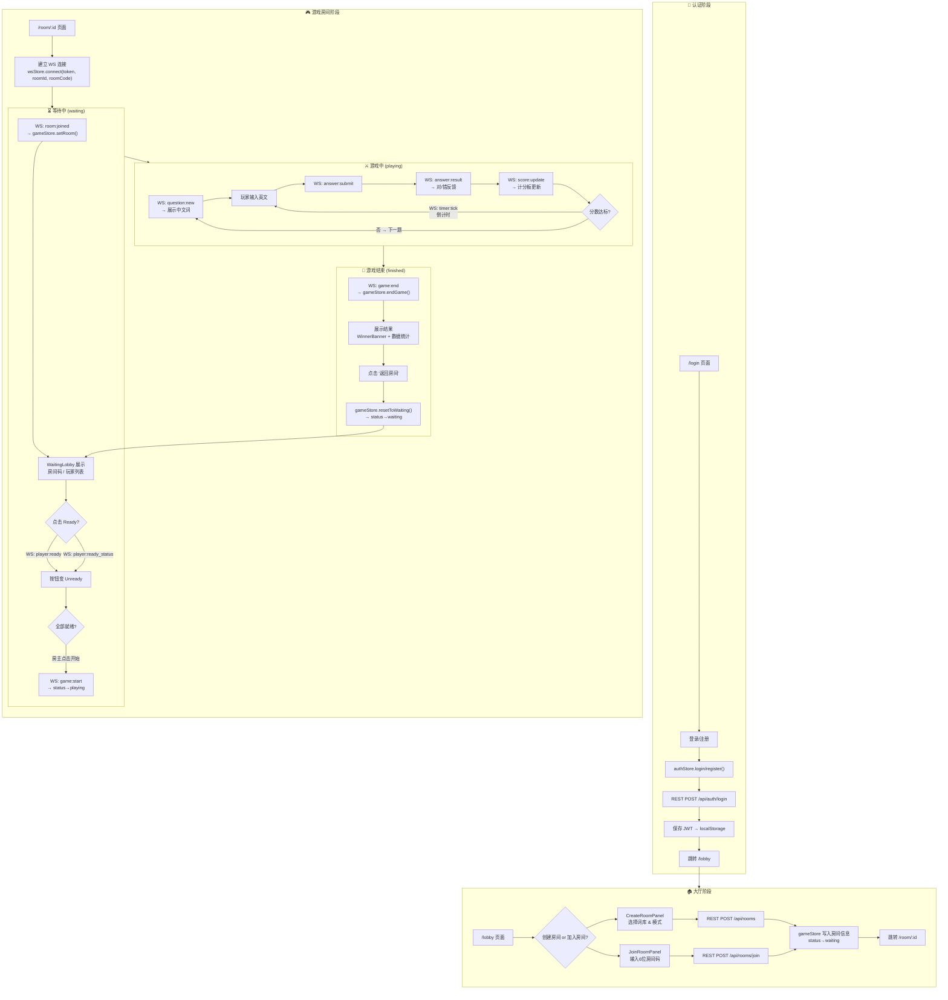
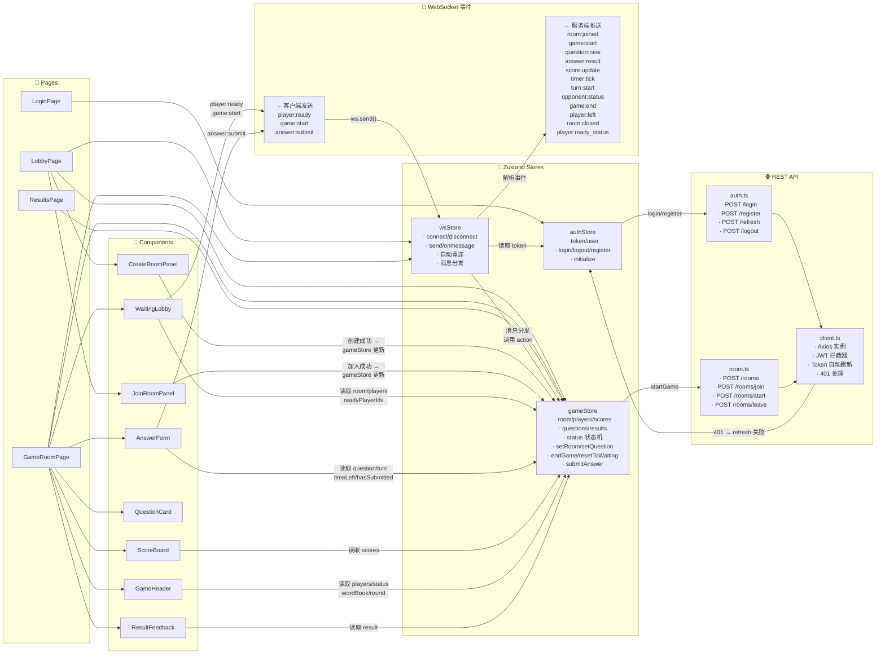
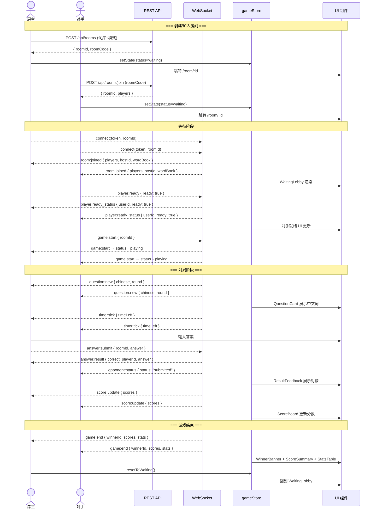

# LingoArena 业务逻辑流程图

## 一、业务逻辑总流程



---

## 二、函数调用关系图



---

## 三、游戏状态机

```mermaid
stateDiagram-v2
    [*] --> idle: 初始化/登出
    idle --> waiting: room:joined → setRoom()
    
    state waiting {
        [*] --> 等待玩家就绪
        等待玩家就绪 --> 全部就绪: player:ready_status\n(所有玩家 ready)
        全部就绪 --> 等待玩家就绪: 有人取消就绪
    end
    
    waiting --> playing: game:start WS 事件
    
    state playing {
        [*] --> 展示题目: question:new
        展示题目 --> 玩家作答: answer:submit (客户端)
        玩家作答 --> 对错反馈: answer:result
        对错反馈 --> 计分更新: score:update
        计分更新 --> 展示题目: 下一题\n(question:new)
        note right of playing
            同时运行:
            timer:tick 倒计时
            opponent:status 对手状态
            turn:start 回合模式
        end note
    end
    
    playing --> finished: game:end
    
    state finished {
        [*] --> 展示胜负结果
        展示胜负结果 --> 选择操作
        选择操作 --> [*]: 点击"返回房间"
    end
    
    finished --> waiting: resetToWaiting()
    idle --> [*]: 离开房间/重置
    
    note right of idle
        reset() 完全重置
        leaveRoom() 调用 REST + 重置
        room:closed → reset()
    end note
```

---

## 四、核心数据流（一次完整对局）



---

## 核心要点总结

| 阶段 | 关键事件 | 状态变化 | 主要组件 |
|------|---------|---------|---------|
| **认证** | REST 登录/注册 | → 获取 JWT | LoginPage |
| **创建/加入房间** | REST POST /rooms 或 /rooms/join | idle → waiting | CreateRoomPanel, JoinRoomPanel |
| **等待** | WS: room:joined, player:ready_status | waiting | WaitingLobby |
| **开始游戏** | WS: game:start | waiting → playing | WaitingLobby (房主触发) |
| **答题** | WS: question:new → answer:submit → answer:result → score:update | playing | QuestionCard, AnswerForm, ResultFeedback |
| **倒计时** | WS: timer:tick | playing | GameHeader |
| **回合模式** | WS: turn:start | playing | AnswerForm (disabled 非当前玩家) |
| **结束** | WS: game:end | playing → finished | WinnerBanner, ScoreSummary, StatsTable, PlayAgainButton |
| **再来一局** | resetToWaiting() | finished → waiting | "Return to Room" 按钮 |
